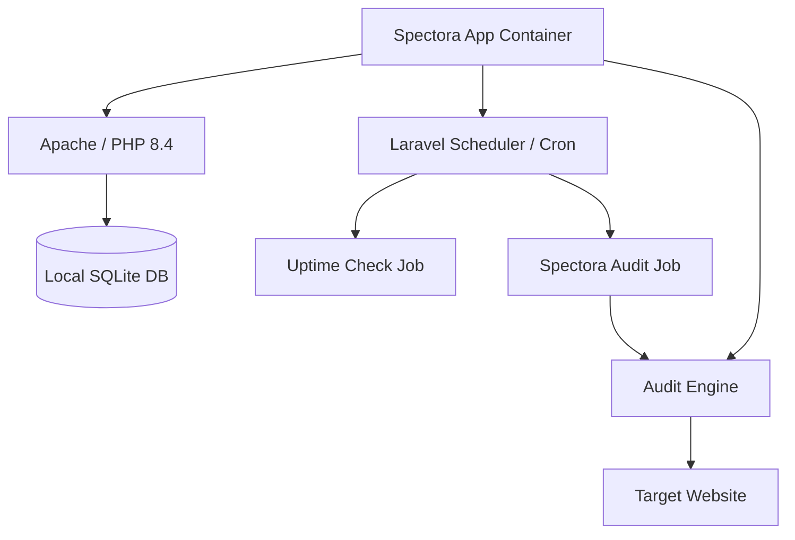

#  Spectora: Website Monitoring Suite

[](https://laravel.com)
[](https://www.docker.com)
[](https://gdpr-info.eu/)
[](https://github.com/Everlite/Spectora)

**Spectora Agency Edition** is a highly specialized, self-hosted monitoring tool for agencies. It was designed to provide a central dashboard for all client domains – minimizing dependency on third-party providers and prioritizing data sovereignty.

---

##  The "Google-Free" Philosophy

Unlike traditional monitoring tools, Spectora operates fully autonomously. All analyses take place **locally within your container**.

*   **Spectora Audit Engine**: Audits are performed via our proprietary heuristic scoring system. It analyzes DOM structure, meta-data, and performance metrics locally. **No Chromium or Lighthouse dependencies are required**, keeping the system lightweight and secure.
*   **No Google Fonts**: We use a modern **System Font Stack**. No external requests, no tracking cookies, maximum loading speed.
*   **No Third-Party CDNs**: All runtime assets (Chart.js, Alpine.js, etc.) are bundled locally. **Nothing is loaded from external servers into the user's browser.**
*   **Private Search Engine Crawler**: Our watchdog identifies itself as `SpectoraBot` to perform security checks without masquerading.

---

##  Core Features

### 1. High-Precision Uptime & Performance
Real-time monitoring of availability and latency for your domains.
*   **Dynamic Metrics**: Real historical 7-day sparklines and precise 1-decimal uptime (e.g., `99.9%`). No placeholders.
*   **Health Scoring**: Proprietary "Spectora Score" based on local heuristic audits (Accessibility, Performance, and Security).

### 2. Universal Security (Double-Layered SSRF Protection)
Spectora implements a state-of-the-art **Double-Layered SSRF Defense** for every system-wide HTTP request:
1.  **Pre-Request Guard**: Every URL is validated against a blacklist of internal/private IPs before a request is initiated.
2.  **Redirect Middleware**: Every redirect hop is intercepted and validated mid-flight to ensure it stays within safe, public bounds.
**All legacy, unhardened monitoring paths (Lighthouse) have been purged from the system.**

### 3. Security Watchdog
An intelligent scanner that checks websites for typical threats:
*   **Malware & Spam**: Scans for pharma-spam, gambling content, and malicious keywords.
*   **SEO Enforcement**: Inspects for `display:none` manipulations and hidden links.
*   **Verification**: Validates Search Console meta tags.

### 4. Enterprise Auth Stack
Fully restored Laravel authentication stack including:
*   **Secure Password Reset** (Requires configured `MAIL_MAILER`)
*   **Email Verification**
*   **Session Management**

---

##  Technical Architecture

Spectora utilizes a modern, dockerized setup that includes all necessary dependencies for local audits.



---

##  Installation

### Prerequisites
*   **Docker & Docker Compose**
*   **Hardware**: Minimum **1 GB RAM** (Optimized for low-resource environments)

### 1. Clone & Start
```bash
git clone https://github.com/Everlite/Spectora.git
cd Spectora
docker compose up -d --build
```

The entrypoint script automatically handles:
*   `.env` creation, `APP_KEY` generation, and Database migrations.

The application is now accessible at **http://localhost:8000**.

---

##  Configuration (.env)

*   **Mail Config**: Required for Password Resets and Email Verification.
    ```env
    MAIL_MAILER=smtp
    MAIL_HOST=...
    MAIL_PORT=587
    ```
*   **App URL**: Set `APP_URL` to your public domain for correct tracking script generation.

---

##  Production Deployment & Analytics Tracking

To use the **Analytics Tracking** feature, Spectora must be reachable via a public domain/subdomain (e.g., `spectora.your-agency.com`).

1.  **HTTPS is Mandatory**: Modern browsers require HTTPS for cross-domain tracking.
2.  **Implementation**: Generate a snippet in the analytics tab. The script (`sp-core.js`) automatically detects its public origin to sync data back to your server.

### 2. DNS & Subdomain Setup
1.  **A-Record**: Create an `A-Record` (e.g., `spectora.your-agency.com`) pointing to your server's public IP.
2.  **Subdomain vs. Main Domain**: We recommend using a dedicated subdomain so your main agency site remains independent.

### 3. Update .env
On your server, modify the `.env` file to set your public URL. This is crucial for the tracking script (`sp-core.js`) to generate correct absolute URLs:
```env
APP_URL=https://spectora.your-agency.com
```

### 4. Implementation Logic
Once Spectora is public, you can generate a **Tracking Snippet** in the domain's analytics tab. 
*   **The Snippet**: `<script src="https://spectora.your-agency.com/js/sp-core.js" data-domain="..." defer></script>`
*   **Automatic Host Detection**: The `sp-core.js` script is intelligent; it automatically detects its own origin and sends data back to your Spectora `/api/sync` endpoint, regardless of which client site it's embedded on.

### 5. Nginx & SSL (HTTPS)
For modern browsers to allow cross-domain tracking, **HTTPS is mandatory**. install Nginx and secure it with Certbot:

```bash
# Install Nginx & Certbot
apt update && apt install nginx certbot python3-certbot-nginx -y

# Setup SSL
certbot --nginx -d spectora.your-agency.com
```

---

##  Analytics: Privacy-by-Design

The Spectora tracking engine was built with the **GDPR** in mind. It provides accurate stats without compromising visitor privacy:
*   **No Cookies**: We do not use any tracking cookies.
*   **Anonymized Hashing**: Visitors are identified via a rotating daily hash composed of `IP + UserAgent + Date + APP_KEY`. This allows unique visitor counting without storing personally identifiable information (PII).
*   **No Third Parties**: No data ever leaves your server. Unlike Google Analytics, your client data is 100% yours.
---

##  Data Privacy & GDPR

Built with **GDPR**-compliance at its core:
*   **No Cookies**: Zero tracking cookies used. Anonymized rotating daily hashing for visitor counts.
*   **Data Sovereignty**: Your analytical and client data remains strictly within your own infrastructure.
*   **Rendering Exception**: To provide professional graph visuals in PDF reports without requiring complex local dependencies (like Chromium), Spectora utilizes **QuickChart.io**. Only anonymized, non-PII data points for the specific chart are transmitted for rendering.

---

##  License & Credits

Developed for agencies that value privacy and independence. 

### 🔄 Definitive Remediation Updates
*   **Engineering**: Upgraded core framework to Laravel 12.
*   **Architecture**: Purged all legacy Lighthouse/Chromium dependencies for a true "1GB RAM" state.
*   **Security**: Closed all SSRF vulnerabilities with double-layered validation middleware across **all** active code paths.
*   **Privacy**: 100% localization of runtime libraries and GDPR-compliant anonymized visitor hashing.
*   **Accuracy**: Unified failure detection, optimized monitoring engines (preventing race-conditions), and real historical trends.

*Created by Everlite.*
