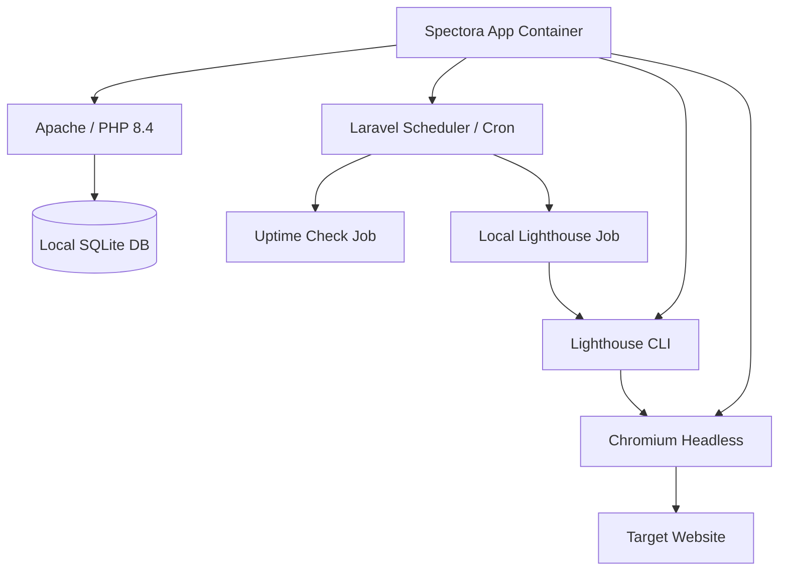

# 🛡️ Spectora: Google-Free Agency Edition

[](https://laravel.com)
[](https://www.docker.com)
[](https://gdpr-info.eu/)
[](https://github.com/Everlite/Spectora)

**Spectora Agency Edition** is a highly specialized, self-hosted monitoring tool for agencies. It was designed to provide a central dashboard for all client domains – without dependency on third-party providers and with maximum data privacy.

---

## 🚀 The "Google-Free" Philosophy

Unlike traditional monitoring tools, Spectora operates fully autonomously. All analyses take place **locally within your container**.

*   **No Google PageSpeed API Key**: Audits are performed via local Lighthouse CLI and Chromium.
*   **No Google Fonts**: We use a modern **System Font Stack**. No external requests, no tracking cookies, maximum loading speed.
*   **No CDNs**: All scripts (including Alpine.js) are bundled locally.
*   **Private Search Engine Crawler**: Our watchdog identifies itself as `SpectoraBot` to perform security checks without masquerading.

---

## 📊 Core Features

### 1. Uptime & Performance Monitoring
Real-time monitoring of availability and latency for your domains.
*   **Interval**: Every 15 minutes (configurable).
*   **Lighthouse Audits**: Full performance scores (Desktop/Mobile) generated directly within your container.

### 2. Security Watchdog
An intelligent scanner that checks websites for typical threats:
*   **Malware Keywords**: Scans for pharma-spam, gambling content, and malicious keywords.
*   **SEO Check**: Inspects for `display:none` manipulations and hidden links.
*   **Verification Checks**: Validates Search Console meta tags.

### 3. SSL & Domain Health
*   **SSL Status**: Displays the remaining validity days of your certificates.
*   **Health Report**: Color-coded dashboard for an immediate overview of critical issues.

### 4. Agency Reporting
Generate professional reports for your clients directly from the dashboard.

---

## 🛠️ Technical Architecture

Spectora utilizes a modern, dockerized setup that includes all necessary dependencies for local audits.



---

## 📥 Installation

### Prerequisites
*   **Docker & Docker Compose**
*   **Hardware**: Minimum **2 GB RAM** (required for Chromium/Lighthouse processes)

### 1. Clone & Start
```bash
git clone https://github.com/Everlite/Spectora.git
cd Spectora
docker compose up -d --build
```

The entrypoint script automatically handles:
*   `.env` creation from `.env.example`
*   `APP_KEY` generation
*   Database migrations
*   Storage link creation

The application is now accessible at **http://localhost:8000**.

---

## ⚙️ Configuration (.env)

Since Spectora uses no external APIs, configuration is minimal:

*   `DB_CONNECTION=sqlite`: Pre-configured by default.
*   `MAIL_*`: Configuration for sending reports.
*   **No API key required for PageSpeed!**

---

## 🛡️ Data Privacy & GDPR

Spectora is the ideal choice for European agencies:
1.  **Data Sovereignty**: All analytical data remains within your own infrastructure.
2.  **Zero Tracking**: No integration of Google Analytics, Fonts, or Maps in the dashboard.
3.  **Client Security**: Your client data is never transmitted to Google servers for analysis.

---

## 📝 License & Credits

Developed for agencies that value privacy and independence. 
*   **Framework**: [Laravel 11](https://laravel.com)
*   **Frontend**: [Alpine.js](https://alpinejs.dev) & Tailwind CSS
*   **Monitoring**: [Lighthouse](https://developers.google.com/web/tools/lighthouse) (Local Version)

---
*Created by Everlite.*
