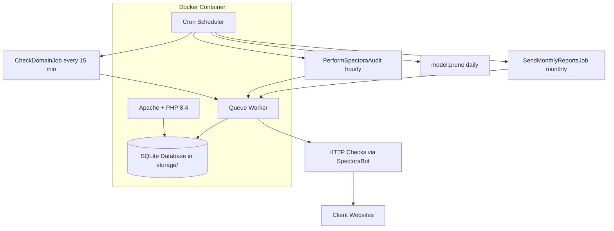

<div align="center">
  
  <h1>Spectora: Private Self-Hosted Website Monitoring Suite</h1>
  
  [](https://laravel.com)
  [](https://php.net)
  [](https://www.docker.com)
  [](LICENSE)
</div>

---

**Spectora** is a premium, open-source, **Private by Design Self-Hosted Website Monitoring Suite** custom-tailored for freelancers and small web agencies. It allows you to monitor all your client websites (uptime, SSL, security keywords, lightweight audits, and optional cookie-free analytics) from one gorgeous, central dashboard on your own server—completely free of SaaS fees and per-seat subscription models.

---

## Private by Design Philosophy

Unlike standard public SaaS applications, Spectora is built as a **single-agency private instance**:
* **Registration Disabled by Default:** The public registration endpoint is securely blocked by default (`SPECTORA_REGISTRATION_ENABLED=false`).
* **Secure CLI Onboarding:** The first administrator account is initialized interactively via a secure terminal interface.
* **Internal User Management:** Administrators can invite/create team members and extra users directly within the secure dashboard settings.
* **Data Sovereignty:** All audit histories, uptime data, and client analytics remain 100% on your own infrastructure inside a fast SQLite database.

---

## Core Features

### Uptime & Performance
- HTTP checking loops every **15 minutes** for the main domain and each active **monitored sub-URL**.
- Automated tracking of response times, HTTP status codes, and SSL certificate expiry.
- Beautiful 7-day sparkline charts generated from real history data.
- Advanced filters including **must-contain** / **must-not-contain** keyword matches.
- Optional monitoring rules: respect `robots.txt`, honour `noindex`, exclude URL patterns, and limit checks to public pages.

### Deep URL Monitoring
- Discover internal links from the homepage, parse **XML sitemaps**, and pick which URLs to watch.
- Per-URL uptime history and status inside the domain dashboard.
- Scan workflow with SSRF-safe outbound requests (`SpectoraBot` user agent).

### Spectora Audits
- Local, lightweight hourly auditing measuring TTFB, HTML weight, title/headings/meta setup, image alt tags, and HTTPS status.
- Generates a **Spectora Score** (0–100) using local rules (no resource-heavy Google Lighthouse or Chromium dependencies required).

### Security Watchdog
- Dynamic scans for suspicious redirects, malware keyword patterns, unsafe scripts, iframes, hidden CSS blocks, and meta-refresh redirects.
- Injects zero-latency verification into normal uptime checks.

### Privacy-First Analytics (Optional)
- Cookie-free tracking of client pageviews using a secure, lightweight `/js/sp-core.js` snippet.
- Dynamic visitor hashing (`IP + User-Agent + APP_KEY + Date`) rotated daily — no persistent visitor IDs across days.
- Origin validation on `/api/sync` (domain UUID + matching host); designed for privacy-friendly, first-party-style analytics (you remain responsible for client consent and privacy notices).

### Automated Reports & Warnings
- **Monthly Agency Email Digest:** Dispatched on the 1st of each month (08:00) with a global health overview (email only, no PDF attachment).
- **On-Demand PDF Reports:** Generate clean, premium PDF report files from the dashboard for client handovers or meetings (optional agency logo on reports).
- **Instant Email Alerts:** Warnings fired immediately when client websites go offline (requires working `MAIL_*` configuration).
- **Browser Push Notifications (Optional):** Web Push via VAPID keys; subscribe from the dashboard when keys are configured.

### Collaboration & Branding
- **Domain notes** per client site (team-visible on the domain detail page).
- **Agency logo upload** in settings — embedded in generated PDF reports.
- **Data retention:** Check history older than **90 days** is pruned automatically (`model:prune` daily).

### Multi-User Administration
- Premium **User Management Panel** inside dashboard settings.
- Admins can list active users, create new team members with administrative privileges, and delete obsolete users.
- **Administrators see every monitored domain** on the dashboard; regular users only see domains they added.
- Strict security blocks to prevent self-deletion, deleting the last administrator, or unauthorized non-admin access.

---

## Architecture


```mermaid
graph TD
    subgraph Docker Container
        A[Apache + PHP 8.4]
        B[Cron Scheduler]
        C[Queue Worker]
        D[(SQLite Database in storage/)]
    end

    B --> E[CheckDomainJob every 15 min]
    B --> F[PerformSpectoraAudit hourly]
    B --> G[SendMonthlyReportsJob monthly]
    B --> H[model:prune daily]

    E --> C
    F --> C
    G --> C

    C --> I[HTTP Checks via SpectoraBot]
    I --> J[Client Websites]

    A --> D
    C --> D
```

---

## Quick Start

### Prerequisites
* Docker & Docker Compose
* ~1 GB RAM
* SMTP credentials (recommended for automated email alerts and digests)

### 1. Start the Container
Clone the repository and run Docker Compose:
```bash
git clone https://github.com/Everlite/Spectora-Website-Monitoring-Suite.git
cd Spectora-Website-Monitoring-Suite
docker compose up -d --build
```
On first launch, Spectora automatically prepares your environment, copies `.env`, runs database migrations, and configures symlinks.

### 2. Run the Interactive Admin Setup
Set up your initial administrator account securely via the command line:
```bash
docker compose exec app php artisan spectora:setup
```
This interactive prompt will securely guide you to enter your **first name, last name, email, and password** to initialize your primary admin account.

Once completed, navigate to **http://localhost:8000**, log in, and begin managing your client sites!

> **Note:** The Docker image runs **Supervisor** with Apache, Cron (scheduler), and a **queue worker**. Uptime checks and audits are queued — no extra setup needed for the default container.

### Local Development (without Docker)

If you prefer running on the host machine:

```bash
composer setup   # install deps, .env, key, migrate, npm build
composer dev     # serves app, queue, logs, and Vite concurrently
php artisan spectora:setup
```

Requires **PHP 8.2+** with extensions: `sqlite3`, `pdo_sqlite`, `mbstring`, `xml`, `curl`, `zip`, `intl`.

---

## Production Deployment

Deploying Spectora in production behind a reverse proxy (such as Nginx Proxy Manager, Caddy, or Traefik) is extremely straightforward and works out-of-the-box:

1. **Set your `APP_URL`**: Use your public HTTPS URL (e.g. `APP_URL=https://spectora.yourdomain.com`). Spectora forces HTTPS for URL generation when `APP_URL` starts with `https://`.
2. **Reverse proxy / TLS termination**: Set `TRUSTED_PROXIES=*` (or comma-separated proxy IPs) so Laravel reads `X-Forwarded-Proto` and real client IPs correctly. Leave empty for local HTTP development.
3. **Proxy without `X-Forwarded-Proto`**: If your proxy terminates TLS but does not forward protocol headers, set `SPECTORA_FORCE_HTTPS=true` in addition to `APP_URL=https://…`.
4. **Configure SMTP** for offline alerts and monthly digests; optional **VAPID** keys for Web Push (see Configuration table below).

---

## Updates from Older Versions (Breaking Changes)

> [!WARNING]
> **Major SQLite Schema Upgrade (May 2026)**
>
> We have completed a transition to a cleaner relational model for user names. In earlier versions, a single flat `name` column was used; this has been refactored into distinct `first_name` and `last_name` fields.
> 
> If you are updating from an installation of Spectora prior to May 2026, you **must** perform a fresh database setup to align your SQLite file with the new database schema:
>
> 1. Clear any active volumes and spin down:
>    ```bash
>    docker compose down -v
>    ```
> 2. Spin the containers back up:
>    ```bash
>    docker compose up -d --build
>    ```
> 3. Reset and run fresh migrations:
>    ```bash
>    docker compose exec app php artisan migrate:fresh
>    ```
> 4. Create your new administrator:
>    ```bash
>    docker compose exec app php artisan spectora:setup
>    ```

---

## Configuration

Copy `.env.example` to `.env` (automatically handled during Docker start) and adjust these key settings:

| Variable | Purpose |
|----------|---------|
| `APP_URL` | Public URL of your instance (analytics snippet, emails, SpectoraBot UA). Use `https://` in production. |
| `TRUSTED_PROXIES` | `*` or comma-separated IPs behind a reverse proxy; leave empty locally. |
| `SPECTORA_FORCE_HTTPS` | `true` if TLS terminates at the proxy without `X-Forwarded-Proto` (optional; usually inferred from `APP_URL`). |
| `SPECTORA_REGISTRATION_ENABLED` | `false` (default) — block public sign-up; create users in Settings or via `spectora:setup`. |
| `DB_DATABASE` | SQLite file path (default in Docker: `/var/www/html/storage/database.sqlite`). |
| `DB_JOURNAL_MODE` / `DB_BUSY_TIMEOUT` | SQLite tuning (defaults: `wal` and `5000` ms) for concurrent web + queue writes. |
| `QUEUE_CONNECTION` | `database` (default) — requires the queue worker (included in Docker via Supervisor). |
| `MAIL_*` | SMTP for offline alerts and monthly digests (`MAIL_MAILER=log` only logs locally). |
| `VAPID_SUBJECT`, `VAPID_PUBLIC_KEY`, `VAPID_PRIVATE_KEY` | Web Push (optional); generate with e.g. `web-push generate-vapid-keys`. |

### Example SMTP Email Setup
```env
MAIL_MAILER=smtp
MAIL_HOST=smtp.example.com
MAIL_PORT=587
MAIL_USERNAME=your-username@example.com
MAIL_PASSWORD=your-secure-password
MAIL_FROM_ADDRESS=monitoring@your-agency.com
MAIL_FROM_NAME="Spectora Monitoring"
```

---

## Technical Stack

Spectora leverages modern web development technologies to ensure high performance, security, and responsive styling:
* **Backend Framework:** [Laravel 12](https://laravel.com)
* **Runtime:** PHP **8.2+** (Docker image ships **PHP 8.4**)
* **Database Engine:** SQLite with WAL mode (fast, serverless, easy to backup via volume)
* **Queue:** Database-backed jobs (checks, audits, mail)
* **Frontend Compilation:** [Vite](https://vite.dev) & Vanilla JS (Alpine.js on dashboard views)
* **Design & Layout:** [Tailwind CSS](https://tailwindcss.com) v3 (dark mode throughout the dashboard)
* **PDF:** [DomPDF](https://github.com/barryvdh/laravel-dompdf) for on-demand client reports
* **Server Runner:** Apache (included in the Docker image; Cron + Supervisor for scheduler and queue)

---

## Security & Hardening

* **SSRF Prevention:** Outbound HTTP uses `SecurityService::http()` — DNS/IP validation, redirect checks, and connect-time IP pinning (`CURLOPT_RESOLVE`) so requests cannot pivot to internal addresses after resolution.
* **Analytics `/api/sync`:** Throttled public endpoint; validates domain UUID and request origin/referrer host (no session cookies; CORS allows cross-origin beacons — protection is server-side origin matching).
* **Login rate limiting:** Five failed attempts per email/IP (Laravel Breeze defaults) before lockout.
* **TLS Termination:** Run production instances behind HTTPS. Browsers block analytics beacons from HTTPS client sites to an HTTP-only Spectora instance.

---

## License & Credits

Spectora is released under the open-source [MIT License](LICENSE). 

Built for freelancers and agencies that value privacy, system control, and predictable costs.

*Created and maintained by [Everlite](https://github.com/Everlite).*
