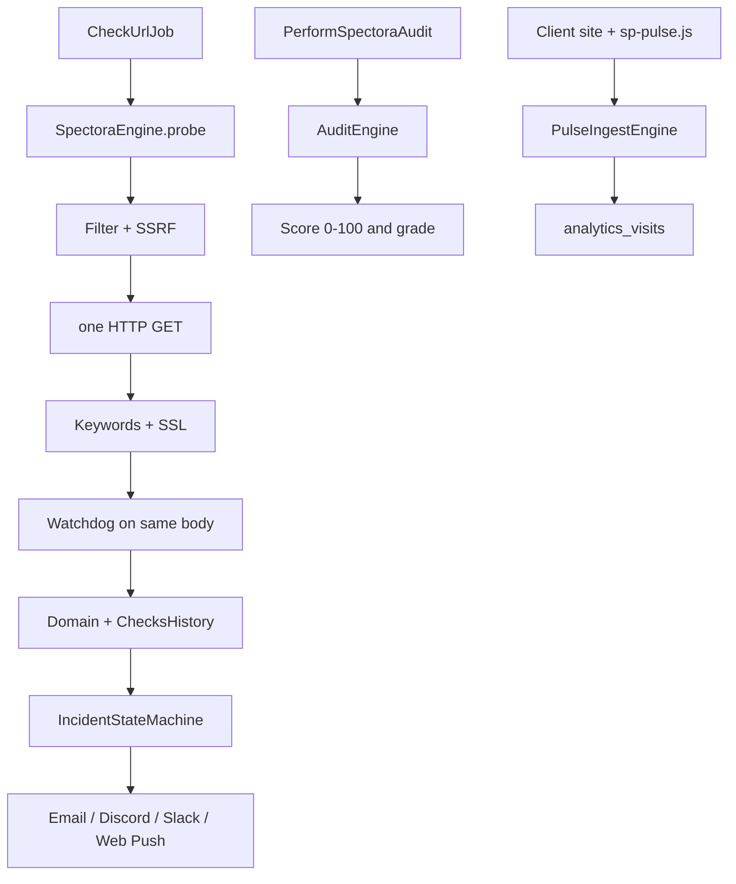

<div align="center">
  
  <h1>Spectora</h1>
  <p>Self-hosted website monitoring for agencies and freelancers.<br>Uptime, SSL, Watchdog, Pulse telemetry — on your server.</p>

  [](https://laravel.com)
  [](https://php.net)
  [](https://www.docker.com)
  [](LICENSE)
</div>

Spectora is a **private-by-design** Laravel app you run yourself. Registration is off by default. There is no SaaS bill and no Google Analytics. Latest tagged release: **v0.2.2**. Current `main` is Pulse-first analytics plus the Engine kernel (see [CHANGELOG](CHANGELOG.md)).

---

## What it does

| Surface | What you get |
| --- | --- |
| **Websites** | Property list: Pulse visitors first, then status, uptime, SSL, Watchdog |
| **Domain report** | Pulse first (visitors, pages, sources, devices, geo), health strip, Engine-Bericht, then log / notes / subpages |
| **Alerts** | Email, Discord/Slack webhooks, Web Push — outage and recovery |
| **Pulse** | Optional cookie-free first-party hits via `sp-pulse.js` |

UI language is German. Tokens live in [DESIGN.md](DESIGN.md) (Studio Dark: canvas `#090B10`, brand `#3B57E8`).

---

## Spectora Engine

Outbound checks go through **one** kernel: `App\SpectoraEngine\SpectoraEngine::probe()`. `CheckUrlJob` only queues that call.


```mermaid
flowchart TD
    Job[CheckUrlJob] --> Probe[SpectoraEngine.probe]
    Probe --> Filter[Filter + SSRF]
    Filter --> Fetch[one HTTP GET]
    Fetch --> Rules[Keywords + SSL]
    Rules --> WD[Watchdog on same body]
    WD --> Persist[Domain + ChecksHistory]
    Persist --> Incidents[IncidentStateMachine]
    Incidents --> Alerts[Email / Discord / Slack / Web Push]

    AuditJob[PerformSpectoraAudit] --> Audit[AuditEngine]
    Audit --> Score[Score 0-100 and grade]

    Client[Client site + sp-pulse.js] --> Pulse[PulseIngestEngine]
    Pulse --> Visits[analytics_visits]
```

- **Probe** — filter, one fetch (`SpectoraBot/2.0`), must/must-not keywords, SSL days, Watchdog on the same HTML, write history, transition incidents.
- **Watchdog** — obfuscated `eval` / `fromCharCode`, CJK title spam, hidden text, tiny iframes, meta-refresh, shady outbound links.
- **Audit** — own PHP checklist (Guzzle + DomCrawler), not Lighthouse or PageSpeed Insights. TTFB, HTML size, title/H1/meta, image alt, HTTPS/HSTS/frame headers. Score 0–100, grades A+–F. DB columns are still named `pagespeed_*` from an older schema.
- **Pulse** — inbound only. Daily rotating HMAC visitor hash, no raw IP stored, no cookies. Origin checked against the monitored host. See [docs/PRIVACY.md](docs/PRIVACY.md).
- **Incidents** — first failure alerts; recovery alert when the target is healthy again.

`sp-core.js` is a backward-compatible alias. New installs use `sp-pulse.js`.

---

## Quick start (Docker)

Needs Docker Compose and about 1 GB RAM. Behind a reverse proxy, set `APP_URL` and `TRUSTED_PROXIES`.

```bash
git clone https://github.com/Everlite/Spectora-Website-Monitoring-Suite.git
cd Spectora-Website-Monitoring-Suite
docker compose up -d --build
docker compose exec app php artisan spectora:setup
```

Then open `http://localhost:8000` and sign in.

**Production** (image build, no source mounts) — from the host checkout:

```bash
git pull origin main
docker compose -f docker-compose.prod.yml up -d --build
```

The container entrypoint already runs `migrate --force` and clears compiled views. Queue and scheduler run under Supervisor. Details: [docs/RUNBOOK.md](docs/RUNBOOK.md).

---

## Configuration

| Variable | Purpose |
| --- | --- |
| `APP_URL` | Public URL of this instance |
| `TRUSTED_PROXIES` | `*` or proxy IPs (Nginx, Traefik, Cloudflare) |
| `SPECTORA_FORCE_HTTPS` | Force HTTPS cookies/assets behind a TLS proxy |
| `SPECTORA_REGISTRATION_ENABLED` | `false` by default — no public sign-up |
| `DB_DATABASE` | SQLite path (Docker: `/var/www/html/storage/database.sqlite`) |
| `QUEUE_CONNECTION` | `database` — required for probes |
| `MAIL_*` | Outage, recovery, monthly digest |
| `VAPID_PUBLIC_KEY` / `VAPID_PRIVATE_KEY` | Web Push (subscribe in the UI) |

---

## Pulse snippet

Put this in the client site `<head>`. `YOUR_DOMAIN_UUID` is on the domain cockpit.

```html
<script defer src="https://your-spectora.example/js/sp-pulse.js" data-domain="YOUR_DOMAIN_UUID"></script>
```

Custom events:

```javascript
window.spectora.track('lead_form_submitted', { plan: 'enterprise' });
```

SPA route changes (`pushState` / `popstate`) are tracked unless you set `data-spa="false"`.

---

## Tests

```bash
docker compose exec app php artisan test
```

Covers probe (one HTTP fetch + Watchdog prefetch), audit, Watchdog, Pulse ingest, incidents, authz.

---

## Docs

- [CHANGELOG.md](CHANGELOG.md) — release notes
- [docs/RUNBOOK.md](docs/RUNBOOK.md) — deploy, queue, scheduler, backups
- [docs/PRIVACY.md](docs/PRIVACY.md) — Pulse / GDPR notes
- [DESIGN.md](DESIGN.md) — UI tokens
- [SECURITY.md](SECURITY.md) — how to report issues

---

## License

[MIT](LICENSE). Maintained by [Everlite](https://github.com/Everlite).
