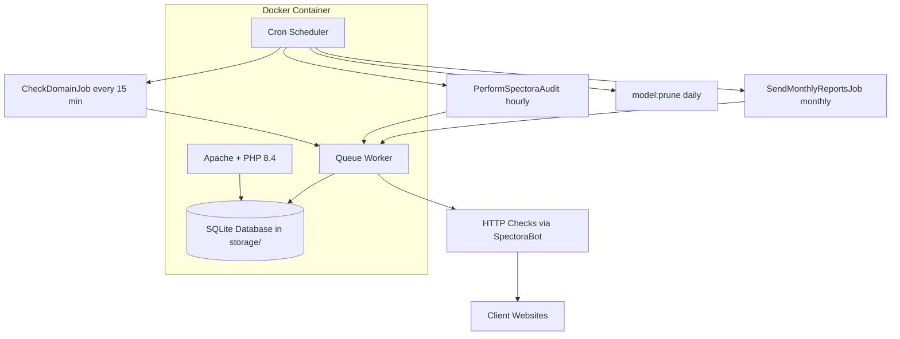

<div align="center">
  
  <h1>Spectora: Private Self-Hosted Website Monitoring Suite</h1>
  
  [](https://laravel.com)
  [](https://php.net)
  [](https://www.docker.com)
  [](LICENSE)
</div>

---

**Spectora** is a premium, open-source, **Private by Design Self-Hosted Website Monitoring Suite** custom-tailored for freelancers and small web agencies. It allows you to monitor all your client websites (uptime, SSL, security keywords, lightweight audits, and optional cookie-free analytics) from one gorgeous, central dashboard on your own server—completely free of SaaS fees and per-seat subscription models.

---

## Private by Design Philosophy

Unlike standard public SaaS applications, Spectora is built as a **single-agency private instance**:
* **Registration Disabled by Default:** The public registration endpoint is securely blocked by default (`SPECTORA_REGISTRATION_ENABLED=false`).
* **Secure CLI Onboarding:** The first administrator account is initialized interactively via a secure terminal interface.
* **Internal User Management:** Administrators can invite/create team members and extra users directly within the secure dashboard settings.
* **Data Sovereignty:** All audit histories, uptime data, and client analytics remain 100% on your own infrastructure inside a fast SQLite database.

---

## Core Features

### Uptime & Performance
- HTTP checking loops every **15 minutes** (main domain + custom sub-URLs).
- Automated tracking of response times, HTTP status codes, and SSL certificate expiry.
- Beautiful 7-day sparkline charts generated from real history data.
- Advanced filters including **must-contain** / **must-not-contain** keyword matches.

### Spectora Audits
- Local, lightweight hourly auditing measuring TTFB, HTML weight, title/headings/meta setup, image alt tags, and HTTPS status.
- Generates a **Spectora Score** (0–100) using local rules (no resource-heavy Google Lighthouse or Chromium dependencies required).

### Security Watchdog
- Dynamic scans for suspicious redirects, malware keyword patterns, unsafe scripts, iframes, hidden CSS blocks, and meta-refresh redirects.
- Injects zero-latency verification into normal uptime checks.

### Privacy-First Analytics (Optional)
- Cookie-free tracking of client pageviews using a secure, lightweight `/js/sp-core.js` snippet.
- Dynamic visitor hashing (`IP + User-Agent + APP_KEY + Date`) rotated daily to prevent historical tracking.
- Completely GDPR/ePrivacy compliant out-of-the-box.

### Automated Reports & Warnings
- **Monthly Agency Email Digest:** Dispatched on the 1st of each month (08:00) with a global health overview.
- **On-Demand PDF Reports:** Generate clean, premium PDF report files from the dashboard for client handovers or meetings.
- **Instant Email Alerts:** Warnings fired immediately when client websites go offline.

### Multi-User Administration
- Premium **User Management Panel** inside dashboard settings.
- Admins can list active users, create new team members with administrative privileges, and delete obsolete users.
- Strict security blocks to prevent self-deletion or unauthorized non-admin access.

---

## Architecture


```mermaid
graph TD
    subgraph Docker Container
        A[Apache + PHP 8.4]
        B[Cron Scheduler]
        C[Queue Worker]
        D[(SQLite Database in storage/)]
    end

    B --> E[CheckDomainJob every 15 min]
    B --> F[PerformSpectoraAudit hourly]
    B --> G[SendMonthlyReportsJob monthly]
    B --> H[model:prune daily]

    E --> C
    F --> C
    G --> C

    C --> I[HTTP Checks via SpectoraBot]
    I --> J[Client Websites]

    A --> D
    C --> D
```

---

## Quick Start

### Prerequisites
* Docker & Docker Compose
* ~1 GB RAM
* SMTP credentials (recommended for automated email alerts and digests)

### 1. Start the Container
Clone the repository and run Docker Compose:
```bash
git clone https://github.com/Everlite/Spectora-Website-Monitoring-Suite.git
cd Spectora-Website-Monitoring-Suite
docker compose up -d --build
```
On first launch, Spectora automatically prepares your environment, copies `.env`, runs database migrations, and configures symlinks.

### 2. Run the Interactive Admin Setup
Set up your initial administrator account securely via the command line:
```bash
docker compose exec app php artisan spectora:setup
```
This interactive prompt will securely guide you to enter your **first name, last name, email, and password** to initialize your primary admin account.

Once completed, navigate to **http://localhost:8000**, log in, and begin managing your client sites!

---

## Production Deployment

Deploying Spectora in production behind a reverse proxy (such as Nginx Proxy Manager, Caddy, or Traefik) is extremely straightforward and works out-of-the-box:

1. **Set your APP_URL**: In your host `.env` file, configure `APP_URL` to your production domain starting with `https://` (e.g., `APP_URL=https://spectora.yourdomain.com`).
2. **Dynamic HTTPS Enforcement**: When `APP_URL` is set to `https://`, Spectora automatically detects this and generates all internal links, route redirects, and compiled Vite assets over secure HTTPS.
3. **Automatic Trusted Proxies**: Spectora automatically trusts reverse proxy headers (e.g. `X-Forwarded-Proto`) in production environments (when `APP_ENV` is not `local`), completely eliminating Mixed Content errors without manual middleware edits.

---

## Updates from Older Versions (Breaking Changes)

> [!WARNING]
> **Major SQLite Schema Upgrade (May 2026)**
>
> We have completed a transition to a cleaner relational model for user names. In earlier versions, a single flat `name` column was used; this has been refactored into distinct `first_name` and `last_name` fields.
> 
> If you are updating from an installation of Spectora prior to May 2026, you **must** perform a fresh database setup to align your SQLite file with the new database schema:
>
> 1. Clear any active volumes and spin down:
>    ```bash
>    docker compose down -v
>    ```
> 2. Spin the containers back up:
>    ```bash
>    docker compose up -d --build
>    ```
> 3. Reset and run fresh migrations:
>    ```bash
>    docker compose exec app php artisan migrate:fresh
>    ```
> 4. Create your new administrator:
>    ```bash
>    docker compose exec app php artisan spectora:setup
>    ```

---

## Configuration

Copy `.env.example` to `.env` (automatically handled during Docker start) and adjust these key settings:

| Variable | Purpose |
|----------|---------|
| `APP_URL` | Public URL of your monitoring instance (crucial for correct analytics snippets & email links). |
| `MAIL_*` | SMTP configuration details to send offline alerts and monthly digests. |
| `DB_DATABASE` | SQLite database absolute file path (default: `/var/www/html/storage/database.sqlite`). |
| `SPECTORA_REGISTRATION_ENABLED` | Set to `false` (default) to secure your instance from public registration. |

### Example SMTP Email Setup
```env
MAIL_MAILER=smtp
MAIL_HOST=smtp.example.com
MAIL_PORT=587
MAIL_USERNAME=your-username@example.com
MAIL_PASSWORD=your-secure-password
MAIL_FROM_ADDRESS=monitoring@your-agency.com
MAIL_FROM_NAME="Spectora Monitoring"
```

---

## Technical Stack

Spectora leverages modern web development technologies to ensure high performance, security, and responsive styling:
* **Backend Framework:** [Laravel 13](https://laravel.com)
* **Runtime:** PHP 8.4 (optimized for speed and low memory footprint)
* **Database Engine:** SQLite (fast, serverless, and easy to backup/volume-mount)
* **Frontend Compilation:** [Vite](https://vite.dev) & Vanilla JS
* **Design & Layout:** [Tailwind CSS](https://tailwindcss.com) (complete dark mode support throughout the dashboard)
* **Server Runner:** Apache (included inside the optimized Dockerfile container)

---

## Security & Hardening

* **SSRF Prevention:** SpectoraBOT features a dual-layer SSRF filter (checks DNS/IP ranges before executing requests and secures redirect handling) to prevent hitting your internal server APIs.
* **Strict CORS & Origin Matching:** Cookie-free tracking requests (`/api/sync`) check monitored domain UUID mappings to block cross-origin requests.
* **TLS Termination:** Always run Spectora behind a secure reverse proxy (like Nginx, Traefik, or Caddy) handling SSL termination. Browsers will block tracking requests made from secure HTTPS clients to insecure unencrypted HTTP instances.

---

## License & Credits

Spectora is released under the open-source [MIT License](LICENSE). 

Built for freelancers and agencies that value privacy, system control, and predictable costs.

*Created and maintained by [Everlite](https://github.com/Everlite).*
