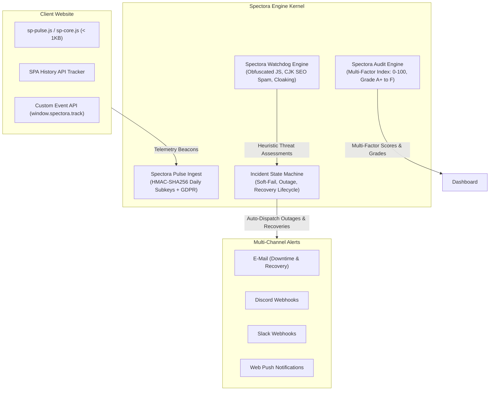

<div align="center">
  
  <h1>Spectora: Private Self-Hosted Website Monitoring Suite</h1>
  
  [](https://laravel.com)
  [](https://php.net)
  [](https://www.docker.com)
  [](https://spectora.taikon.de)
  [](LICENSE)

  <p align="center">
    <strong>Powered by the proprietary Spectora Engine™ · Bespoke Studio Dark UI · Self-Hosted &amp; Private by Design</strong><br>
    Laravel 12 · Docker · Heuristic Watchdog · Multi-Factor Audits · Zero-Cookie Pulse Telemetry · Discord &amp; Slack Webhooks · Multi-Channel Recovery Alerts
  </p>
</div>

---

> [!IMPORTANT]
> **Spectora v2.4: Custom Studio Dark Architecture & Spectora Engine Ecosystem (2026)**
> Spectora features a 100% custom-crafted, bespoke **Spectora Studio Dark UI** paired with the autonomous **Spectora Engine** ecosystem:
> 1. **Bespoke Studio Dark Theme:** Deep Charcoal canvas (`#090B10`), Matte Obsidian cards (`#111622`), Studio Cobalt (`#3B57E8`), Emerald Mint (`#10B981`), Plus Jakarta Sans and JetBrains Mono typography, high-utility sidebar, and streamlined data tables.
> 2. **Spectora Audit Engine:** Multi-factor scoring matrix (0–100, Grade A+ to F) evaluating TTFB, payload size, H1 hierarchy, SEO snippets, image alt tags, and security headers.
> 3. **Spectora Watchdog Engine:** Heuristic malware scanner detecting obfuscated JS (`eval`, `String.fromCharCode`), CJK SEO title spam, cloaking, and hidden iframes.
> 4. **Spectora Pulse Telemetry:** Privacy-first, zero-cookie telemetry kernel with SPA History API auto-tracking and custom conversion tracking (`window.spectora.track`).
> 5. **Incident State Machine & Multi-Channel Alerting:** Intelligent outage & recovery lifecycle with direct Discord and Slack Webhooks, E-Mail, and Web Push.

**Spectora** is a premium, open-source, **Private by Design Self-Hosted Website Monitoring Suite** custom-tailored for freelancers and modern digital agencies. It allows you to monitor all your client websites (uptime, SSL, security keywords, deep audits, telemetry, and threat detection) from one central command center on your own server—completely free of recurring SaaS subscriptions.

---

## 🏛️ The Proprietary Spectora Engine Architecture


```mermaid
flowchart TD
    subgraph ClientSite [Client Website]
        SP["sp-pulse.js / sp-core.js (< 1KB)"]
        SPA["SPA History API Tracker"]
        CE["Custom Event API (window.spectora.track)"]
    end

    subgraph SpectoraCore [Spectora Engine Kernel]
        PULSE["Spectora Pulse Ingest\n(HMAC-SHA256 Daily Subkeys + GDPR)"]
        AUDIT["Spectora Audit Engine\n(Multi-Factor Index: 0-100, Grade A+ to F)"]
        WATCHDOG["Spectora Watchdog Engine\n(Obfuscated JS, CJK SEO Spam, Cloaking)"]
        STATE["Incident State Machine\n(Soft-Fail, Outage, Recovery Lifecycle)"]
    end

    subgraph Channels [Multi-Channel Alerts]
        MAIL["E-Mail (Downtime & Recovery)"]
        DISCORD["Discord Webhooks"]
        SLACK["Slack Webhooks"]
        WEBPUSH["Web Push Notifications"]
    end

    ClientSite -->|Telemetry Beacons| PULSE
    AUDIT -->|Multi-Factor Scores & Grades| Dashboard
    WATCHDOG -->|Heuristic Threat Assessments| STATE
    STATE -->|Auto-Dispatch Outages & Recoveries| Channels
```

---

## 🎨 Bespoke Studio Dark UI

The application interface is a 100% bespoke design system crafted exclusively for Spectora:

* **Matte Studio Foundations:** Deep `#090B10` canvas with elevated `#111622` cards and razor-sharp `#202A3E` borders.
* **Purposeful Accent Palette:**
  * Primary Brand: **Studio Cobalt (`#3B57E8` / `#4F6BFF`)**
  * Health / Online: **Clean Emerald (`#10B981`)**
  * Degraded / Warning: **Polished Amber (`#F59E0B`)**
  * Outage / Threat: **Coral Crimson (`#F43F5E`)**
* **Left Studio Navigation:** Brand header, system node telemetry pill, and user profile.
* **Fleet KPI Deck & Unified Tables:** Real-time latency (in ms), SSL expiration countdowns, and quick actions (`Code </>`, `Details`, `Notes`, `Delete`).
* **Interactive Command Center:** Segmented controllers for Overview, Pulse Telemetry, Watchdog & Audits, Probe Logs, and Subpage Monitors.

---

## ⚡ Core Modules & Features

Outbound checks run through `App\SpectoraEngine\SpectoraEngine::probe()` (one HTTP fetch, then keywords, watchdog, persist, incidents). `CheckUrlJob` is the queue wrapper. Audit stays a separate job; Pulse is inbound.

### 1. Spectora Audit Engine (`App\SpectoraEngine\Audit`)
* **Multi-Factor Scoring Matrix (0–100 Index & Letter Grades A+ to F):**
  * **Performance:** Server TTFB (Time-To-First-Byte) and HTML payload size optimization.
  * **Structure & SEO:** Single H1 hierarchy enforcement, `<title>` snippet validation, and `<meta name="description">` audits.
  * **Accessibility:** Automatic verification of image `alt` attributes.
  * **Security:** HTTPS enforcement, Strict-Transport-Security (HSTS), X-Frame-Options framing defenses, and X-Content-Type-Options.

### 2. Spectora Watchdog Engine (`App\SpectoraEngine\Watchdog`)
* Deep heuristic malware, cloaking, and defacement detection running with zero latency overhead during uptime checks:
  * **Obfuscated Payloads:** Detects `eval(String.fromCharCode(...))`, `document.write(unescape(...))`, and browser cryptominers.
  * **SEO Spam Hijacking:** Detects Japanese Keyword Hack (CJK unicode spam) and common hack titles (casino, payday, pharma).
  * **Black-Hat Cloaking:** Flags text hidden via `display:none`, `visibility:hidden`, and extreme negative text-indents.
  * **Malicious Iframes:** Flags hidden 0px/1px iframes used for credential harvesting or drive-by downloads.
  * **Defacement Redirects:** Catches client-side meta-refresh redirect attacks.

### 3. Spectora Pulse Telemetry (`App\SpectoraEngine\Pulse`)
* **Zero-Cookie Privacy Telemetry:**
  * Ultra-lightweight `< 1KB` tracking kernel ([public/js/sp-pulse.js](public/js/sp-pulse.js)).
  * **SPA Navigation Support:** Automatically tracks route changes in Single Page Applications (React, Vue, Next.js, Nuxt) via the History API (`pushState` / `popstate`).
  * **Custom Conversion Events:** Allows client websites to track conversion actions:
    ```javascript
    window.spectora.track('lead_form_submitted', { plan: 'enterprise' });
    ```
  * **GDPR-Compliant Daily Visitor Hashing:** Generates rotating `HMAC-SHA256` visitor hashes with truncated IPs and daily rotating server subkeys. No raw IP addresses or persistent cookies are ever stored.

### 4. Incident State Machine & Multi-Channel Alerting (`App\SpectoraEngine\Incidents`)
* **Incident Lifecycle Management:** Tracks consecutive failures and prevents alert storms.
* **Instant Outage Alerts:** Triggered on confirmed failures across configured channels.
* **Automated Recovery Alerts:** Automatically dispatches a resolution alert as soon as the site recovers healthy HTTP responses.
* **Multi-Channel Dispatcher:**
  * **Discord Webhooks:** Rich visual embeds with error details and direct dashboard jump links.
  * **Slack Webhooks:** Formatted incident cards for agency communication channels.
  * **E-Mail Alerts:** HTML downtime warnings and recovery digests.
  * **Web Push Notifications:** Real-time desktop and mobile browser push notifications via VAPID.

---

## 🚀 Quick Start with Docker

### Prerequisites
* Docker & Docker Compose
* ~1 GB RAM
* Reverse Proxy (e.g. Nginx, Traefik, Caddy, Cloudflare, or Nginx Proxy Manager)

### 1. Start the Container
Clone the repository and spin up the environment:
```bash
git clone https://github.com/Everlite/Spectora-Website-Monitoring-Suite.git
cd Spectora-Website-Monitoring-Suite
docker compose up -d --build
```

### 2. Run the Interactive Admin Setup
Initialize your primary administrator account securely via the CLI:
```bash
docker compose exec app php artisan spectora:setup
```
Enter your **first name, last name, email, and password** when prompted.

Navigate to your domain or **http://localhost:8000**, log in, and explore your command center!

---

## ⚙️ Configuration (.env)

| Variable | Purpose |
| :--- | :--- |
| `APP_URL` | Public URL of your instance (e.g. `https://spectora.taikon.de`). |
| `TRUSTED_PROXIES` | Set to `*` or proxy IPs behind reverse proxies (Nginx, Traefik, Cloudflare). |
| `SPECTORA_FORCE_HTTPS` | `true` — ensures secure cookie and asset generation behind HTTPS proxies. |
| `SPECTORA_REGISTRATION_ENABLED` | `false` (default) — disables public sign-up for agency privacy. |
| `DB_DATABASE` | SQLite database path (default in Docker: `/var/www/html/storage/database.sqlite`). |
| `QUEUE_CONNECTION` | `database` (default) — executed automatically via Docker Supervisor. |
| `MAIL_*` | SMTP configuration for email alerts, recovery notifications, and monthly digests. |
| `VAPID_PUBLIC_KEY` / `VAPID_PRIVATE_KEY` | Web Push notification keys (subscribe directly from the UI). |

---

## 📡 Pulse Client Tracking Code

To enable privacy-first telemetry on a client website, embed this snippet in the `<head>` of your website:

```html
<!-- Spectora Pulse Telemetry Kernel -->
<script defer src="https://spectora.yourdomain.com/js/sp-pulse.js" data-domain="YOUR_DOMAIN_UUID"></script>
```

### Tracking Custom Events
```javascript
// Track button clicks, form submissions, or conversions
window.spectora.track('lead_form_submitted', { plan: 'enterprise' });
```

---

## 🧪 Testing

Spectora includes a complete test suite covering the engine kernels, security filters, and incident workflows:

```bash
# Run unit and feature tests
docker compose exec app php artisan test
```

---

## 📄 License & Credits

Spectora is open-source software licensed under the **[MIT License](LICENSE)**.

Built with passion for freelancers and agencies that value privacy, elegance, and complete data ownership.

*Created and maintained by [Everlite](https://github.com/Everlite).*
