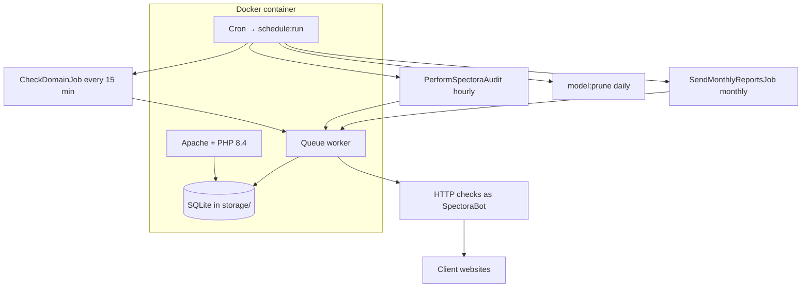

# Spectora: Website Monitoring Suite

[](https://laravel.com)
[](https://www.docker.com)
[](LICENSE)

**Spectora Agency Edition** is a free, open-source, self-hosted monitoring tool for **freelancers and small web agencies**. Manage all client domains from one dashboard — uptime, SSL, security, lightweight audits, and optional privacy-friendly analytics — without per-seat SaaS fees.

Originally conceived as a SaaS product, Spectora was released as open source to help agencies with limited budgets own their monitoring stack and keep client data on their own infrastructure.

---

## Who is this for?

| Good fit | Less ideal |
|----------|------------|
| Small agencies (≈5–50 client sites) | Large DevOps teams needing Prometheus/Grafana |
| WordPress / classic website care | Mobile app or API-only backends |
| Agencies that want GDPR-friendly analytics | “Sign up and forget” with zero server setup |
| Teams comfortable with Docker on a VPS | Fully managed cloud-only workflows |

---

## Core features

### Uptime & performance
- HTTP checks every **15 minutes** (main URL + optional sub-URLs)
- Response time, HTTP status, SSL expiry
- Uptime % and 7-day sparklines from real check history
- Custom **must-contain** / **must-not-contain** keywords per domain

### Spectora Audit (heuristic score)
- Hourly local audit: TTFB, HTML size, H1/title/meta, image `alt`, HTTPS
- **Spectora Score** (0–100) — stored in DB columns named `pagespeed_*` for historical reasons; no Google Lighthouse or Chromium required

### Security Watchdog
- Spam/malware keyword patterns, suspicious links/scripts/iframes
- Hidden content detection, meta-refresh redirects
- Runs during uptime checks (single HTTP request per URL)

### Privacy analytics (optional)
- Cookie-free tracking via `sp-core.js` snippet
- Daily rotating visitor hash (`IP + User-Agent + date + APP_KEY`)
- Requires a **public HTTPS** Spectora instance for cross-domain sync

### Reports & notifications
- **Monthly agency digest email** (1st of each month, 08:00) — overview of all domains, no PDF attachment
- **PDF report on demand** — generate from the domain dashboard before client meetings (day-accurate snapshot)
- **Instant warning emails** when the main domain check fails (if mail is configured)

### Agency workflow
- Multi-domain dashboard per user account
- Domain notes, monitoring filters (robots.txt, noindex, URL patterns)
- Sitemap-based URL discovery and selective sub-URL monitoring
- Admin users can access any domain (`is_admin`)

---

## Architecture


```mermaid
graph TD
    subgraph Docker container
        A[Apache + PHP 8.4]
        B[Cron → schedule:run]
        C[Queue worker]
        D[(SQLite in storage/)]
    end

    B --> E[CheckDomainJob every 15 min]
    B --> F[PerformSpectoraAudit hourly]
    B --> G[SendMonthlyReportsJob monthly]
    B --> H[model:prune daily]

    E --> C
    F --> C
    G --> C

    C --> I[HTTP checks as SpectoraBot]
    I --> J[Client websites]

    A --> D
    C --> D
```

All monitoring HTTP requests use **double-layer SSRF protection** (pre-request DNS/IP validation + redirect middleware).

---

## Quick start

### Prerequisites
- Docker & Docker Compose
- ~1 GB RAM
- SMTP settings (recommended for alerts, password reset, monthly digest)

### Install

```bash
git clone https://github.com/Everlite/Spectora-Website-Monitoring-Suite.git
cd Spectora-Website-Monitoring-Suite
docker compose up -d --build
```

Open **http://localhost:8000**, register an account, and add your first domain.

The entrypoint automatically creates `.env`, generates `APP_KEY`, runs migrations, and links storage. The container runs **Apache**, **cron** (scheduler), and a **queue worker**.

---

## Configuration

Copy `.env.example` to `.env` (done automatically on first Docker start) and adjust:

| Variable | Purpose |
|----------|---------|
| `APP_URL` | Public URL of your instance (required for analytics snippet & correct links in emails) |
| `MAIL_*` | SMTP for warnings, monthly digest, password reset |
| `DB_DATABASE` | SQLite path (default: `storage/database.sqlite`) |
| `QUEUE_CONNECTION` | Keep `database` (worker included in Docker) |
| `VAPID_*` | Optional: browser push notifications |

Example mail block:

```env
MAIL_MAILER=smtp
MAIL_HOST=smtp.example.com
MAIL_PORT=587
MAIL_USERNAME=your@email.com
MAIL_PASSWORD=secret
MAIL_FROM_ADDRESS=monitoring@your-agency.com
MAIL_FROM_NAME="Spectora"
```

---

## Scheduled tasks

| Schedule | Task |
|----------|------|
| Every 15 min | Uptime + SSL + Watchdog for all domains |
| Hourly | Spectora Audit (heuristic score) |
| Daily | Prune `checks_history` older than 90 days |
| 1st of month, 08:00 | Monthly agency digest email |

Manual **Analyze** on a domain runs audit + checks immediately (synchronous).

---

## Analytics setup (optional)

1. Deploy Spectora on a subdomain, e.g. `spectora.your-agency.com`
2. Set `APP_URL=https://spectora.your-agency.com`
3. Terminate TLS (e.g. Nginx + Certbot)
4. In the domain’s **Analytics** tab, copy the tracking snippet:

```html
<script src="https://spectora.your-agency.com/js/sp-core.js" data-domain="YOUR-DOMAIN-UUID" defer></script>
```

Events POST to `/api/sync` (rate-limited). Origin must match the monitored domain (`www` and apex are treated as equivalent).

---

## Privacy & third parties

- **No Google Fonts, Analytics, or Lighthouse** in the monitoring stack
- **Chart.js and scripts** are bundled under `public/js/`
- **PDF charts**: generated via [QuickChart.io](https://quickchart.io) when you download a report — only anonymized chart data points are sent; no visitor PII
- **Analytics data** stays in your SQLite database

---

## PDF reports vs monthly email

| | Monthly email | PDF download |
|---|---------------|--------------|
| **When** | Automatic, 1st of month | Manual, anytime |
| **Content** | Agency summary (OK vs issues) | Full per-domain report with charts |
| **Use case** | Inbox triage across all clients | Client meeting / handover |
| **Attachment** | None (links to dashboard) | PDF file |

---

## Development

```bash
composer install
cp .env.example .env
php artisan key:generate
php artisan migrate
php artisan test
```

---

## License & credits

MIT — see [LICENSE](LICENSE).

Built for agencies that value privacy, independence, and predictable costs.

*Created by [Everlite](https://github.com/Everlite).*
