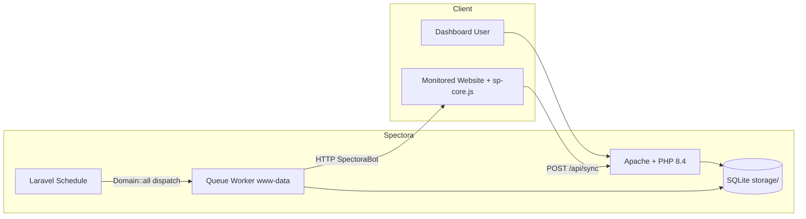

# Spectora — Projekt-Audit (v2)

**Datum:** 30. Mai 2026  
**Version:** 2.0 (Erweiterung nach Peer-Review: Security-Tiefe, Betrieb, ehrliche Checkliste)  
**Scope:** Gesamtes Repository (`Spectora/`, Anwendung in `spectora-app/`)  
**Art:** Read-only Review — keine Code-Änderungen  
**Nicht im Scope:** Penetrationstest, Lasttest, dynamische SSRF-Exploits

---

## Kurzfassung

Spectora ist eine gut dokumentierte, selbst gehostete Laravel-12-Anwendung für Website-Monitoring, Audits und optionale Analytics. Architektur, Privacy-by-Design und Docker-Deployment sind durchdacht. Die größten Hebel liegen bei **HTTPS/Proxy**, **Scheduler-Skalierung** (`Domain::all()`), **SQLite unter Schreiblast**, **Container-Härtung** und **Engineering-Hygiene** (CI, Tests, SaaS-Legacy).

**Bewertung:** ~8/10 als Projekt-/Architektur-Audit (v2). **Implementiert:** Connect-Time-SSRF via `CURLOPT_RESOLVE` in `SecurityService::http()`.

---

## Was gut ist

### Produkt & Dokumentation

- **README** ist außergewöhnlich stark: Features, Mermaid-Architektur, Docker Quick Start, Production, Breaking Changes (Mai 2026), SMTP, Security-Abschnitt.
- **„Private by Design“:** Registrierung default aus, `spectora:setup`, Team-Verwaltung im Dashboard.
- **Feature-Breite** ohne Lighthouse/Chromium: Uptime, SSL, Keywords, Watchdog, Spectora-Score, PDF, E-Mail, Web Push, cookie-freie Analytics.

### Architektur & Code-Organisation

- **Service-Layer:** `SecurityService`, `WatchdogService`, `MonitoringFilterService`, `SitemapService`, `AnalyticsQueryService`, `ReportService`.
- **Jobs + Scheduler** mit `withoutOverlapping()`, tägliches `model:prune` (90 Tage History).
- **DomainPolicy** + `authorize()` in den relevanten Controllern.
- **HostHelper** + Tests für www/apex bei Analytics.
- **ChecksHistory:** `Prunable`, `uptimeChecks()`-Scope, Uptime-Tests.

### Sicherheit (Grundlagen)

- **SSRF-Vorfilter** vor Outbound-HTTP (siehe Tiefe unten — kein vollständiger Connect-Time-Schutz nachgewiesen).
- **Analytics:** UUID, Origin/Referer, `throttle:120,1`, Visitor-Hash mit Tages-Salt + `APP_KEY`, `supports_credentials: false`.
- **Login:** Breeze-`LoginRequest` — **5 Fehlversuche** pro `email|ip`, dann Lockout-Event (siehe Abschnitt Authentifizierung).
- **Admin-Middleware**, Selbstlöschung blockiert, Registration per Config (mit Tests).

### DevOps

- Dockerfile mit Asset-Build, Apache + Cron + Supervisor, Entrypoint (`.env`, `APP_KEY`, SQLite nach `storage/`).
- Healthcheck in Compose; Composer `dev`/`setup`/`test`.

### Tests (inhaltlich)

- Admin-Setup, User-Management, Analytics-Origin, Uptime, `HostHelper` — sinnvoll, aber Security/Jobs dünn.

---

## Vertiefung: SSRF (`SecurityService`)

### Was implementiert ist

1. **Vor dem Request:** `parse_url` → Host blocklist (`localhost`) → bei Hostname DNS `A`/`AAAA` → jede IP mit `FILTER_FLAG_NO_PRIV_RANGE | FILTER_FLAG_NO_RES_RANGE` + explizite Loopback-Checks.
2. **Bei Redirects:** Guzzle `on_redirect` ruft erneut `isSafeUrl()` auf die Ziel-URI auf.

Das ist **über dem Laravel-Default** und für typische „scan internal IP“-Fälle sinnvoll.

### Was statisch nicht als „erledigt“ gilt

| Risiko | Status |
|--------|--------|
| **TOCTOU / DNS-Rebinding** | ⚠️ Prüfung erfolgt vor `Http::get()`; ob Guzzle/cURL die **Ziel-IP beim Connect** nochmal gegen Private Ranges validiert, wurde **nicht** verifiziert. Klassischer Bypass bei kurzlebigen DNS-Antworten. |
| **Redirect zu erlaubter Domain → interne IP** | ⚠️ Redirect-Handler prüft URL erneut per DNS — gleiche TOCTOU-Frage pro Hop. |
| **Nicht-HTTP-Schemes / file://** | Nicht separat geprüft; App nutzt überwiegend `Http::get` mit http(s)-URLs. |
| **Automatisierte SSRF-Tests** | Fehlen (kein Test für Redirect-Kette, private IP, rebinding-Szenario). |

**Empfehlung:** Connect-Time-Validation (Custom Guzzle-Handler / `CURLOPT_RESOLVE` mit geprüfter IP), oder dedizierter Outbound-Proxy; SSRF-Regressionstests in CI.

---

## Vertiefung: Authentifizierung & öffentliche Endpunkte

### Login Brute-Force

```php
// app/Http/Requests/Auth/LoginRequest.php
RateLimiter::tooManyAttempts($this->throttleKey(), 5);
// throttleKey: Str::lower(email) . '|' . $request->ip()
```

- **5 Versuche** pro E-Mail+IP, dann Lockout mit `auth.throttle`-Meldung — Laravel-Breeze-Standard, ausreichend für kleine Self-Hosted-Instanzen.
- **Optional härten:** globales IP-Limit unabhängig von E-Mail; 2FA für Admins; Fail2ban vor Reverse Proxy.

### Analytics `/api/sync` & CORS

- **CORS `allowed_origins: *`** in `config/cors.php` — für diesen Endpunkt **kein klassisches Session/Cookie-Risiko** (`supports_credentials: false`), Schutz liegt in App-Logik (UUID + Host-Match).
- **Bewertung:** Stil/Hardening, **nicht** High-Prio-Security. Optional Origins einschränken oder in Doku begründen.
- **Missbrauch:** 120 req/min Throttle; kein PII in Payload; Visitor-Hash abhängig von `$request->ip()` → bei `trustProxies *` korrekte Proxy-Konfiguration kritisch.

---

## Vertiefung: SQLite & Concurrency

Spectora ist auf SQLite festgelegt (`.env.example`, README). Bei gleichzeitigen **Web-Requests**, **Queue-Worker**, **Scheduler** und vielen **INSERTs** in `checks_history` / `analytics_visits`:

| Faktor | Ist-Zustand |
|--------|-------------|
| `journal_mode` | `null` in `config/database.php` → SQLite-Default (oft DELETE, nicht explizit WAL) |
| `busy_timeout` | `null` → kein konfiguriertes Warten bei Locks |
| Worker | Ein Queue-Worker in Supervisor; Scheduler dispatcht Jobs für **alle** Domains |

**Symptome bei Skalierung:** `SQLITE_BUSY`, langsame Checks, Scheduler-Überlappung trotz `withoutOverlapping()` auf DB-Ebene.

**Empfehlung (Mittel/Hoch bei vielen Domains):**

- `PRAGMA journal_mode=WAL`, `busy_timeout` (z. B. 5000–10000 ms) in SQLite-Config oder Migration/Startup.
- Backup-Strategie mit WAL berücksichtigen (`-wal`/`-shm`).
- Ab N Domains / hoher Schreiblast: **MySQL/PostgreSQL** dokumentieren oder offiziell unterstützen.
- Scheduler: nicht `Domain::all()` in einem Tick — chunken, staggered dispatch, oder ein Job „dispatch checks for batch“.

---

## Vertiefung: Docker & Container

| Komponente | User | Anmerkung |
|------------|------|-----------|
| Supervisor | `root` | `docker/supervisord.conf` |
| Apache | `root` (via `apachectl`) | Prozesse darunter typisch `www-data`, aber Master als root |
| Queue Worker | `www-data` | gut |
| Cron | `root` | Scheduler läuft mit Root-Rechten im Container |

**Risiko:** Kompromittierung im Container → breitere Rechte als nötig. Für Self-Hosted akzeptabel, für gehärtete Production **Mittel-Prio**.

**Empfehlung:** Non-root-Image-Pattern (Apache-Variante, `USER www-data`), read-only RootFS wo möglich, Cap-Drop in Compose-Doku; ungenutztes Volume `spectora-db` entfernen oder dokumentieren.

---

## Was ich ändern würde

### Priorität: Hoch

| Thema | Beobachtung | Empfehlung |
|--------|-------------|------------|
| **HTTPS erzwungen global** | `public/index.php` setzt immer `HTTPS=on`; `AppServiceProvider` → `URL::forceScheme('https')` ohne Env-Check. Widerspricht README. | Nur bei `https://` in `APP_URL` oder explizitem Flag. |
| **Trusted Proxies `*`** | `bootstrap/app.php` + `TrustProxies`. | Proxy-IPs/CIDRs in Production; sonst IP-Spoofing (Analytics-Hash, Rate-Limits). |
| **Scheduler-Wurzel** | **`Domain::all()`** alle 15 Min./Stunde — lineares Wachstum; jeder Tick lädt gesamte Tabelle. | Chunking, Batch-Jobs, Limits; Lasttest-Doku. |
| **`dispatchSync` in Jobs** | `CheckDomainJob` synct Haupt-URL + alle Sub-URLs — blockiert Worker, verstärkt Scheduler-Last. | Async Queue; Sync nur für manuelles `analyze()`. |
| **SQLite unter Last** | Kein WAL/Busy-Timeout konfiguriert. | WAL + busy_timeout; Upgrade-Pfad DB. |
| **Letzter Admin** | Nur Selbstlöschung verboten. | Mindestens ein weiterer `is_admin` vor Löschung. |
| **SSRF Connect-Time** | Vor-Request + Redirect-Recheck, aber TOCTOU offen. | Connect-Time-Bindung + Tests. |

### Priorität: Mittel

| Thema | Beobachtung | Empfehlung |
|--------|-------------|------------|
| **Admin vs. Dashboard** | Policy: Admin darf fremde Domain per URL; Dashboard: nur `$user->domains()`. | **Produktentscheidung** (Multi-Mandant pro User ist legitim) — in Doku klären; UI/Policy-Inkonsistenz als UX-Thema. |
| **Docker root** | Supervisor/Apache/Cron als root. | Non-root-Härtung dokumentieren oder umsetzen. |
| **Tailwind 3 vs 4** | `@tailwindcss/vite` ^4 + `tailwindcss` ^3; `app.css` TW3-Syntax. | Angleichen; **CI mit `npm run build`** — kann echte Build-Fehler verursachen. |
| **Repository-Layout** | Nur `spectora-app/` unter `Spectora/`. | Root-README oder Repo flatten. |
| **SaaS-Erbe** | Historische Migrations + `convert_out_of_saas`. | Schema-Squash / `schema:dump` für Greenfield. |
| **Kein CI** | Keine GitHub Actions. | test + pint + build. |
| **Testlücken** | Kein SecurityService/SSRF/Job/Watchdog. | Regressionstests für kritische Pfade. |
| **Passwort-Policy** | User-Anlage `min:8` ohne `Rules\Password`. | Einheitlich mit Breeze. |
| **Session** | `SESSION_ENCRYPT=false` in `.env.example`. | Production-Doku: `true`. |
| **Sanctum** | Installiert, kaum genutzt. | **Behalten** wenn API/Mobile geplant; sonst dokumentieren — kein akutes Risiko. |
| **Rate Limiting Web** | Analytics + Login abgedeckt; viele POST-Routen ohne Extra-Throttle. | Domain anlegen, Scan, Analyze drosseln. |

### Priorität: Niedrig

| Thema | Empfehlung |
|--------|------------|
| composer.json Metadaten | Spectora-spezifisch benennen |
| Vendored `chart.min.js` | npm/Vite oder Version pinnen |
| Sprachmix im Code | EN oder DE vereinheitlichen |
| User `$fillable` `'name'` | Legacy entfernen |
| Setup Timezone hardcoded | Abfragen oder Config |
| Example-Tests | Entfernen oder Smoke-Test |
| Watchdog UA `example.com` | `APP_URL` nutzen |

---

## Architektur (Ist-Zustand)



---

## Sicherheits-Checkliste (ehrlich)

| Kontrolle | Status |
|-----------|--------|
| Auth auf geschützten Routen | ✅ `auth` Middleware |
| Domain-Autorisierung (Controller) | ✅ Policy in Controllern |
| Login Brute-Force | ✅ 5 Versuche / `email\|ip` (Breeze) |
| SSRF outbound HTTP | ⚠️ Vorfilter + Redirect-Check + **Connect-Time IP-Pinning** (`SecurityService::http()`); dynamische Rebinding-Exploits nicht pen-getestet |
| Öffentliche Registration | ✅ Default aus |
| CSRF Web | ✅ Laravel Standard |
| Analytics Missbrauch | ⚠️ Throttle + Origin; CORS `*` unkritisch ohne Credentials |
| Secrets in Repo | ✅ `.env` gitignored |
| HTTPS/Proxy | ⚠️ HTTPS global erzwungen; `trustProxies *` |
| SQLite Integrität unter Last | ⚠️ WAL/Busy-Timeout nicht gesetzt |
| Container Least-Privilege | ⚠️ Apache/Supervisor/Cron als root |

---

## Test-Übersicht

| Bereich | Abdeckung |
|---------|-----------|
| Auth / Registration off | Gut |
| Login Rate Limit | Nicht explizit getestet (Code vorhanden) |
| Admin User CRUD | Gut |
| Analytics Origin | Gut |
| Uptime-Berechnung | Gut |
| HostHelper | Gut |
| SSRF / SecurityService | Fehlt |
| Jobs / Watchdog / PDF | Fehlt |
| CI automatisiert | Fehlt |

**Hinweis:** Lokale PHPUnit-Läufe scheiterten ohne `pdo_sqlite` — in Docker/CI sicherstellen.

---

## Empfohlene Reihenfolge (v2)

1. **HTTPS/Proxy** — Verhalten an README und lokale Dev anpassen.  
2. **Scheduler** — `Domain::all()` entlasten; `dispatchSync`-Ketten in Queue-Worker reduzieren.  
3. **SQLite** — WAL + `busy_timeout`; Skalierungsgrenzen dokumentieren.  
4. **SSRF** — Connect-Time-Härtung + Tests.  
5. **CI** — `composer test`, Pint, `npm run build`.  
6. **Docker** — Non-root / Doku; Admin-Dashboard als Produktentscheidung dokumentieren.  
7. Rest (SaaS-Squash, Tailwind, Sanctum-Strategie, Metadaten).

---

## Changelog v1 → v2

- SSRF: von pauschalem ✅ auf Tiefe + TOCTOU-Hinweis
- SQLite-Concurrency und Docker root ergänzt
- Login: konkret 5 Versuche dokumentiert
- CORS `*`: als Stil/Hardening, nicht High-Security
- Sanctum: behalten wenn API geplant
- Tailwind: auf Mittel (Build-Risiko)
- Scheduler: Ursache `Domain::all()` vs. Symptom `dispatchSync`
- Admin-Dashboard: Produktentscheidung vs. Bug

---

## Fazit

Spectora ist für **Agency Self-Hosting** bereits **reif und praxisnah**: starke Doku, Privacy-Defaults, durchdachte Monitoring-Features. v2 ergänzt die **letzte Meile**: ehrliche Security-Grenzen (SSRF, Proxy, SQLite, Container), konkrete Auth-Details und klarere Skalierungsursachen. Offen bleibt dynamische Verifikation (Pen-Test, Lasttest, SSRF-Exploit-Tests).

*Statische Code- und Config-Analyse; Peer-Review-Feedback (Claude Opus) in v2 eingearbeitet.*
